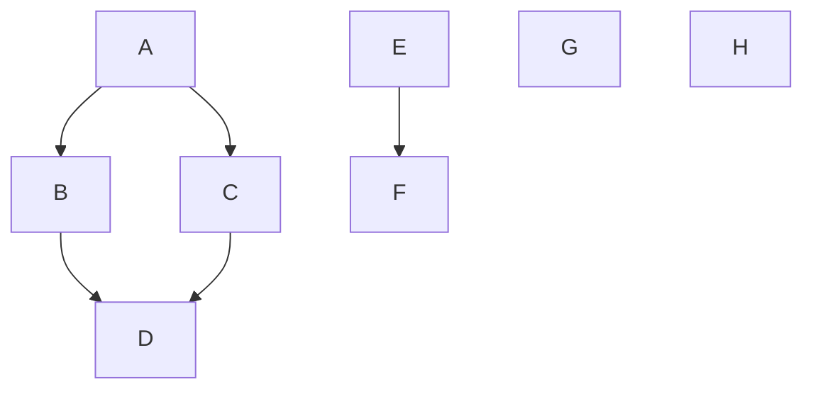
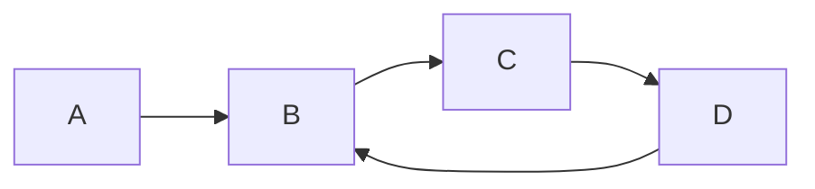
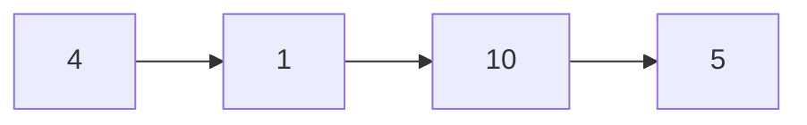

LVK.TopoSort
===

[](https://github.com/lassevk/LVK.TopoSort/actions/workflows/build.yml)
[](https://codecov.io/github/lassevk/LVK.TopoSort)
[](https://github.com/lassevk/LVK.TopoSort/actions/workflows/github-code-scanning/codeql)

This library implements topological sorting, which allows you to per-item specify dependencies, like
"Item B must come after Item A", and then let the sorting algorithm figure out one correct order that satisfies
all the constraints.

Example
---



```csharp
Constraint<string>[] constraints = [
    Topo.Constrained("A", "B"),
    Topo.Constrained("A", "C"),
    Topo.Constrained("B", "D"),
    Topo.Constrained("C", "D"),
    Topo.Constrained("E", "F"),
    Topo.Element("G"),
    Topo.Element("H"),
];

foreach (var grp in constraints.OrderedGroups())
    Console.WriteLine(string.Join(", ", grp));
```

One correct output from this would be:

```text
A, E, G, H
B, C, F
D
``` 

The `OrderedGroups` method will return groups of elements, where each group has no intra-dependencies.
In the example above, there are no dependencies between `A`, `E`, `G`, and `H`.

The `OrderedGroups` takes an optional `IComparer<T>` comparer that for each such group orders the individual
elements in the group. By default the `Comparer<T>.Default` is used.

There is also another method, `Ordered` that expands these groups, with the exact same constraints,
the following code:

```csharp
foreach (var element in constraints.Ordered())
    Console.WriteLine(element);
```

Would output this:

```text
A
E
G
H
B
C
F
D
``` 

The same elements, just as individual elements and not grouped together.

Cycles
---
If the constraint graph contains cycles, an exception will be thrown during enumeration.

Example:



```csharp
Constraint<string>[] constraints = [
    Topo.Constrained("A", "B"),
    Topo.Constrained("B", "C"),
    Topo.Constrained("C", "D"),
    Topo.Constrained("D", "B"),
];

foreach (var grp in constraints.OrderedGroups())
    Console.WriteLine(string.Join(", ", grp));
```

This will throw an `TopologicalCycleException`. There is a property on this exception, `Elements`, that contains
the elements still in the graph at the point where the cycle was detected, which in the above case would be all the
elements except `A`.

Constrained vs. Unconstrained
---

Constrained elements are pairs of elements where there is a strict ordering implied, but the strict ordering is only
implied between those two elements, the constraint does not predicate ordering involving other elements.

Example:

```csharp
Topo.Constrained(1, 10)
```

The above method call will return a constraint that predicates that `1` must come before `10`, but it does not
say anything about the values between `1` and `10`, nor anything about values before `1` or after `10`, when
we think about numerical values and their numerical order.

As such, here is a slightly larger example:

```csharp
Topo.Constrained(1, 10),
Topo.Constrained(10, 5),
Topo.Constrained(4, 1)
```

The graph for these constraints would look like this:



Additionally, to add single elements to the graph that has no constraints whatsoever, the `Topo.Element`
creates such a "constraint", that can be ordered together with the other constraints. These elements will be
returned as part of the first group of elements.

Also, note that you can mention the same elements more than once, but due to the graph not allowing for duplicates,
the output will only mention each element once, according to the rules of the `IEqualityComparer<T>` involved.

Example:

```csharp
Constraint<int>[] constraints = [
    Topo.Element(1),
    Topo.Element(10),
    Topo.Element(5),
    Topo.Element(4),
    Topo.Constrained(1, 10),
    Topo.Constrained(10, 5),
    Topo.Constrained(4, 1)
];
```

Extension Methods and Conversion Operators
---

There are also implicit conversion operators for single element values, as well as an extension methods for pair-wise
constraints, so the above example can be rewritten as:

```csharp
Constraint<int>[] constraints = [
    1, 10, 5, 4,
    1.FollowedBy(10),
    10.FollowedBy(5),
    4.FollowedBy(1),
];
```
